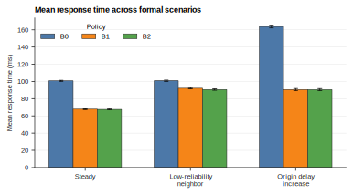
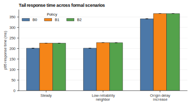
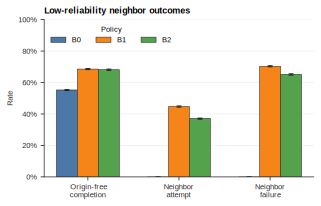
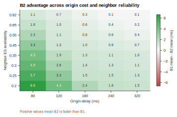
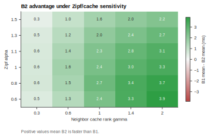
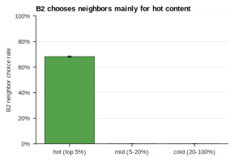

# Phase 1.1 实验报告：Request-Level B2 与 Zipf/Cache-Rank 敏感性分析

日期：2026-06-03

这份报告解释 Phase 1.1 到底做了什么、为什么这样做、实验如何运行、每张图应该怎么看，以及从审稿人的角度还剩哪些问题。目标读者是假设完全不熟悉这个仓库的人，所以会从 B0/B1/B2 的基本定义开始说明。

## 1. 一句话结论

这次更新最重要的变化是：B2 不再是“一个场景里固定做同一种选择”，而是变成“每个请求单独判断是否值得搜索邻居 ES”。

换句话说，B1 的逻辑是：只要 local ES 不够，就一定先搜索 neighbor ES。B2 的逻辑是：先估计这个请求从 neighbor ES 恢复成功的概率和期望延迟，只有当 neighbor fallback 的期望延迟不高于直接访问 origin 时，才搜索 neighbor ES。

所以这次实验想证明的不是“B2 在所有情况下都大幅优于 B1”。更准确、更稳妥的结论是：

> B2 可以抑制 B1 中低价值的 neighbor 搜索，同时在热门内容、邻居成功率较高、或者 neighbor fallback 期望延迟更低时继续利用邻居协作。

这个结论最清楚地体现在两个地方：

1. heatmap 显示 B2 在某些参数区域明显优于 B1；
2. hot/mid/cold rank bucket 图显示 B2 主要对热门内容选择 neighbor，对 mid/cold 内容抑制 neighbor 搜索。

## 2. 这个项目研究什么

项目研究的是低可信 edge cache 环境中的 fallback policy。文件被切成多个 chunk，恢复一个文件至少需要 `K` 个 chunk。用户请求一个内容时，系统先尝试从 local ES 集合拿到足够 chunk。如果 local ES 不够，就需要决定下一步怎么做。

三个策略如下。

| 策略 | 含义 |
| --- | --- |
| B0 | local ES 无法恢复文件时，直接从 origin 获取缺失数据。 |
| B1 | local ES 无法恢复文件时，先搜索 neighbor ES；如果 neighbor 仍然不够，再访问 origin。 |
| B2 | local ES 无法恢复文件时，先估计 neighbor 搜索是否值得；只有当 neighbor 的期望延迟不高于 origin 时，才搜索 neighbor。 |

研究问题可以写成：

> 当 local ES 无法恢复文件时，系统应该直接访问 origin，还是应该先搜索附近的 neighbor ES？

B1 的问题是它太“固执”：不管请求的是热门内容还是冷门内容，只要 local 失败就尝试 neighbor。这在 neighbor 成功概率高时可能有用，但在 neighbor 不可靠或内容很冷时会引入额外探测延迟，最后仍然要访问 origin，造成双重延迟。B2 的目标就是减少这种无效搜索。

## 3. 这次到底改了什么

主要代码改动在 `src/edge_cache_sim/simulator.py`。

每个请求现在会记录更多可解释字段。

| 字段 | 含义 |
| --- | --- |
| `content_rank` | 请求内容在 Zipf 分布中的 rank。rank 1 表示最热门内容。 |
| `local_chunks` | local ES 提供的 chunk 数量。 |
| `missing_chunks` | 恢复文件还缺多少个 chunk。 |
| `neighbor_cache_probability` | 按内容 rank 估计 neighbor ES 缓存该内容 chunk 的概率。 |
| `neighbor_chunk_probability` | neighbor ES 可用率乘以 rank-aware cache probability。 |
| `b2_neighbor_success_probability` | B2 估计 neighbor 搜索能补齐缺失 chunk 的概率。 |
| `b2_expected_neighbor_delay` | B2 估计“先搜索 neighbor”的期望延迟。 |
| `b2_neighbor_selected` | B2 对这个请求是否选择搜索 neighbor。 |

新的 B2 判断公式如下。

```text
missing_chunks = K - local_chunks

p_cache(rank) =
    cold + (hot - cold) * rank ** (-zipf_alpha * cache_rank_gamma)

p_chunk =
    neighbor_es_availability * p_cache(rank)

P_success =
    Pr(Binomial(neighbor_group_size, p_chunk) >= missing_chunks)

E_neighbor =
    P_success * neighbor_recovery_delay
    + (1 - P_success) * (neighbor_probe_delay + origin_delay)

B2 searches neighbors only when:
    E_neighbor <= origin_delay
```

新增的默认参数如下。

| 参数 | 默认值 | 含义 |
| --- | ---: | --- |
| `neighbor_cache_hot_prob` | 0.90 | 热门内容在 neighbor cache 中的较高命中概率上限。 |
| `neighbor_cache_cold_prob` | 0.15 | 冷门内容在 neighbor cache 中的较低命中概率下限。 |
| `neighbor_cache_rank_gamma` | 1.00 | cache probability 对内容 rank 的敏感程度。 |

需要注意：这仍然是第一阶段 Monte Carlo simulation，不是真实 CDN 排队系统，也没有模拟真实 origin 拥塞队列、服务容量或 cache replacement。

## 4. 实验设置

正式 Phase 1.1 实验使用如下设置。

| 设置 | 数值 |
| --- | ---: |
| trials | 10 |
| 每个 trial 的请求数 | 10,000 |
| content library size | 500 |
| 恢复阈值 `K` | 3 |
| local ES 数量 | 3 |
| neighbor group size | 5 |
| 默认 Zipf alpha | 1.1 |
| 默认 local ES availability | 0.82 |
| 默认 seed | 20260525 |

三组正式场景如下。

| 场景 | neighbor availability | origin delay | 实验目的 |
| --- | ---: | ---: | --- |
| `steady` | 0.82 | 180 ms | 普通稳定场景，比较 B0/B1/B2 的基本表现。 |
| `low_reliability_neighbor` | 0.25 | 180 ms | 模拟 neighbor ES 低可靠，观察 B2 能否抑制无效 neighbor 搜索。 |
| `origin_congestion` | 0.82 | 320 ms | 这里实际表示 origin delay increase，不是完整拥塞排队模型。 |

额外敏感性实验如下。

| 实验 | 参数 |
| --- | --- |
| Neighbor/origin heatmap | `neighbor_es_availability x origin_delay` |
| Zipf/cache heatmap | `zipf_alpha = [0.6, 0.8, 1.0, 1.1, 1.3, 1.5]`，`neighbor_cache_rank_gamma = [0.3, 0.6, 1.0, 1.4, 2.0]` |
| Rank bucket analysis | hot top 5%，mid 5-20%，cold 20-100% |

## 5. 如何复现实验

在仓库根目录运行：

```powershell
python -m venv .venv
.\.venv\Scripts\Activate.ps1
pip install -r requirements.txt
```

运行单元测试：

```powershell
python -m unittest discover -s tests
```

运行正式实验：

```powershell
python scripts\run_scenarios.py --trials 10 --num-requests 10000 --output-dir results/phase1_b2_zipf
python scripts\run_b2_zipf_sweep.py --trials 10 --num-requests 10000 --output-dir results/phase1_b2_zipf
python scripts\build_figures.py --results-dir results/phase1_b2_zipf
python scripts\write_manifest.py --output-dir results/phase1_b2_zipf --command "python scripts/run_scenarios.py --trials 10 --num-requests 10000 --output-dir results/phase1_b2_zipf" --command "python scripts/run_b2_zipf_sweep.py --trials 10 --num-requests 10000 --output-dir results/phase1_b2_zipf" --command "python scripts/build_figures.py --results-dir results/phase1_b2_zipf"
```

快速 smoke test 可以用更小规模：

```powershell
python scripts\run_scenarios.py --trials 2 --num-requests 1000 --output-dir results/phase1_b2_zipf
python scripts\run_b2_zipf_sweep.py --trials 2 --num-requests 1000 --output-dir results/phase1_b2_zipf
python scripts\build_figures.py --results-dir results/phase1_b2_zipf
```

本批次的命令、git 状态、参数和输出文件记录在：

```text
results/phase1_b2_zipf/manifest.json
```

## 6. 三个正式场景的结果

下面两张图比较 B0、B1、B2 在三个正式场景中的 mean response time 和 p95 response time。



**图 1. Mean response time。** B1 和 B2 的平均响应时间明显低于 B0，因为 neighbor cooperation 可以让一部分请求不访问 origin。B2 在三个场景中都略优于 B1，但从这个三场景柱状图看，优势并不大。

| 场景 | 策略 | mean response time | p95 response time | origin-free rate | neighbor attempt rate | neighbor failure rate | B2 choice rate | B2 相对 B1 优势 |
| --- | --- | ---: | ---: | ---: | ---: | ---: | ---: | ---: |
| steady | B0 | 100.7794 | 201.4137 | 0.5531 | 0.0000 | 0.0000 | 0.0000 |  |
| steady | B1 | 67.8475 | 225.9995 | 0.8371 | 0.4469 | 0.3644 | 0.0000 |  |
| steady | B2 | 67.5729 | 225.1959 | 0.8321 | 0.4081 | 0.3164 | 0.9131 | 0.2746 ms |
| low_reliability_neighbor | B0 | 100.8571 | 201.4713 | 0.5526 | 0.0000 | 0.0000 | 0.0000 |  |
| low_reliability_neighbor | B1 | 92.1258 | 228.3606 | 0.6854 | 0.4474 | 0.7030 | 0.0000 |  |
| low_reliability_neighbor | B2 | 90.5697 | 227.4472 | 0.6817 | 0.3708 | 0.6515 | 0.8287 | 1.5561 ms |
| origin_congestion | B0 | 163.8599 | 341.4185 | 0.5514 | 0.0000 | 0.0000 | 0.0000 |  |
| origin_congestion | B1 | 90.6103 | 365.9864 | 0.8375 | 0.4486 | 0.3623 | 0.0000 |  |
| origin_congestion | B2 | 90.5334 | 365.9026 | 0.8374 | 0.4450 | 0.3573 | 0.9920 | 0.0769 ms |



**图 2. 95th percentile response time。** B2 相对 B1 的 p95 有轻微改善，尤其在低可靠 neighbor 场景中更明显一点。但是 B1/B2 的 p95 不一定优于 B0，因为 neighbor 搜索失败时，请求会先付出 neighbor probe delay，随后仍然访问 origin，形成更长尾延迟。

所以这里不能过度宣称“B2 全面降低尾延迟”。更准确的说法是：

> B2 改善了 B1 的选择性，但在当前第一阶段模型中还不能完全消除 neighbor fallback 带来的 tail-latency 风险。

## 7. 低可靠 neighbor 场景



**图 3. 低可靠 neighbor 场景下的 neighbor attempt / failure / origin-free rate。** 这张图解释了为什么 B2 在低可靠 neighbor 场景中优于 B1。B1 在每次 local failure 后都尝试 neighbor，所以 neighbor attempt rate 高，neighbor failure rate 也高。B2 会跳过一部分期望延迟不划算的 neighbor 搜索。

低可靠 neighbor 场景中的关键数值如下。

| 策略 | mean response time | p95 response time | neighbor attempt rate | neighbor failure rate | origin-free rate |
| --- | ---: | ---: | ---: | ---: | ---: |
| B1 | 92.1258 | 228.3606 | 0.4474 | 0.7030 | 0.6854 |
| B2 | 90.5697 | 227.4472 | 0.3708 | 0.6515 | 0.6817 |

B2 的 origin-free rate 比 B1 略低，但它减少了无效 neighbor attempt，因此 mean 和 p95 都比 B1 好。这说明 B2 的价值不是“永远更多地利用 neighbor”，而是“只在值得的时候利用 neighbor”。

## 8. Neighbor/Origin 敏感性 heatmap



**图 4. B2 相对 B1 的优势随 neighbor availability 和 origin delay 的变化。** 颜色表示 `B1 mean response time - B2 mean response time`。数值为正表示 B2 比 B1 快。

最大优势出现在 neighbor recovery 不够可靠、B1 的“总是先搜索 neighbor”容易带来额外探测成本的区域。

| neighbor availability | origin delay | B2 mean response time | B2 p95 response time | B2 choice rate | B2 相对 B1 优势 |
| ---: | ---: | ---: | ---: | ---: | ---: |
| 0.20 | 80 ms | 55.5580 | 102.9925 | 0.1535 | 6.6260 ms |
| 0.25 | 80 ms | 55.0568 | 104.5177 | 0.2257 | 5.6867 ms |
| 0.30 | 80 ms | 54.6144 | 103.1562 | 0.2264 | 4.8921 ms |
| 0.20 | 120 ms | 71.1947 | 161.4456 | 0.2701 | 4.4362 ms |
| 0.35 | 80 ms | 54.2094 | 106.1263 | 0.3105 | 4.2711 ms |

这张图需要谨慎解释。B2 相对 B1 的最大优势不一定出现在最高 origin delay。原因是当 origin delay 很高时，B1 的 neighbor-first 行为反而更有价值，因为避免 origin 很重要，所以 B2 会更接近 B1。当 origin delay 适中、neighbor success 较弱时，B1 更容易浪费 neighbor probe delay，而 B2 会抑制这些搜索，因此 B2 和 B1 的差距最明显。

这说明 B2 的优势有两种：

1. 在 neighbor 有价值时使用 neighbor；
2. 在 neighbor 低价值时不搜索 neighbor。

当前 heatmap 更突出第二种优势。

## 9. Zipf 与 cache-rank 敏感性



**图 5. B2 相对 B1 的优势随 Zipf alpha 和 cache-rank gamma 的变化。** 这张图测试内容请求分布和 neighbor cache rank 敏感性是否会影响 B2 的可见性。

最大优势如下。

| Zipf alpha | cache-rank gamma | B2 mean response time | B2 p95 response time | B2 choice rate | B2 相对 B1 优势 |
| ---: | ---: | ---: | ---: | ---: | ---: |
| 0.6 | 2.0 | 55.1575 | 101.9383 | 0.1135 | 3.9040 ms |
| 0.8 | 2.0 | 54.8202 | 102.2680 | 0.1622 | 3.7136 ms |
| 0.8 | 1.4 | 54.6669 | 102.8622 | 0.2166 | 3.3545 ms |
| 1.0 | 2.0 | 54.1363 | 102.4376 | 0.2453 | 3.3275 ms |
| 0.6 | 1.4 | 55.3137 | 103.1861 | 0.1849 | 3.3009 ms |

最清楚的趋势是：`neighbor_cache_rank_gamma` 很重要。当 cache probability 对 rank 更敏感时，B2 更容易区分“值得搜索 neighbor 的热门内容”和“不值得搜索 neighbor 的冷门内容”。`zipf_alpha` 的影响不是完全单调，因为它同时影响请求是否集中在热门内容上，也和 cache-rank 模型共同作用。

这说明：

> Zipf 和 cache-rank 参数不能只作为背景假设固定下来。它们会实质性影响 B2 是否明显，以及 B2 多常选择 neighbor。

## 10. Hot/Mid/Cold 内容 rank bucket



**图 6. B2 在不同内容热度 bucket 下的 neighbor choice rate。** 这是解释 Phase 1.1 最关键的一张图。它显示 B2 不再是场景级固定策略，而是会根据请求内容 rank 做不同选择。在这个 decision-boundary 设置下，B2 对 hot content 经常选择 neighbor，但对 mid/cold content 基本不选择 neighbor。

| rank bucket | 每个 trial 平均请求数 | 每个 trial 平均 local failure 数 | B2 neighbor choice rate | origin-free rate | neighbor failure rate | mean response time |
| --- | ---: | ---: | ---: | ---: | ---: | ---: |
| hot top 5% | 6421.2 | 2898.8 | 0.6823 | 0.7853 | 0.2312 | 50.8194 |
| mid 5-20% | 1766.1 | 780.8 | 0.0000 | 0.5580 | 0.0000 | 55.7168 |
| cold 20-100% | 1812.7 | 827.3 | 0.0000 | 0.5436 | 0.0000 | 56.7775 |

这张图支持本阶段最重要的论点。

| 内容类型 | B2 行为 | 原因 |
| --- | --- | --- |
| hot content | 经常搜索 neighbor | rank-aware cache probability 高，neighbor 搜索的期望延迟可能低于 origin。 |
| mid/cold content | 基本跳过 neighbor | neighbor cache probability 低，neighbor 搜索的期望延迟高于 origin。 |

因此，如果想向老师或审稿人解释“B2 为什么有意义”，应该优先展示图 6，然后再用图 4 和图 5 说明参数区域。

## 11. 测试与验证

这次提交前完成了以下检查。

| 检查 | 结果 |
| --- | --- |
| `python -m unittest discover -s tests` | 17 tests passed |
| `python -m compileall src scripts tests` | passed |
| 三场景正式实验 | 10 trials，每个 trial 10,000 requests |
| Zipf/cache sweep | 10 trials，每个 trial 10,000 requests |
| 图表生成 | SVG/PDF 已生成；PNG/TIFF 仅用于本地视觉 QA |

单元测试覆盖了以下内容。

| 测试点 | 作用 |
| --- | --- |
| Zipf probabilities | `zipf_alpha` 增大时，请求更偏向热门内容。 |
| cache probability monotonicity | 内容 rank 越冷，neighbor cache probability 越低。 |
| missing chunks | neighbor recovery 使用 `missing_chunks`，而不是固定重新拿到 `K` 个 chunk。 |
| request-level B2 | 同一场景下，B2 能对 hot/cold 请求做不同选择。 |
| repeated trials | 新增指标列在 repeated-trial 输出中稳定存在。 |

## 12. 文件地图

| 路径 | 作用 |
| --- | --- |
| `src/edge_cache_sim/simulator.py` | request-level B2 判断逻辑和每请求输出字段。 |
| `src/edge_cache_sim/config.py` | 新增 cache-rank 参数。 |
| `src/edge_cache_sim/metrics.py` | 新增 summary metrics，例如 neighbor attempt rate 和 B2 choice rate。 |
| `src/edge_cache_sim/repeated.py` | repeated-trial 聚合逻辑。 |
| `scripts/run_scenarios.py` | 三个正式场景实验入口。 |
| `scripts/run_b2_zipf_sweep.py` | neighbor/origin grid、Zipf/cache grid、rank bucket 实验入口。 |
| `scripts/build_figures.py` | Nature-style 静态图构建脚本。 |
| `scripts/write_manifest.py` | 写入结果批次 manifest。 |
| `results/phase1_b2_zipf/*.csv` | 正式结果表。 |
| `results/phase1_b2_zipf/figures/*.svg` | GitHub 上主要阅读的图。 |
| `results/phase1_b2_zipf/figures/*.pdf` | 论文或报告可用的 vector figure。 |
| `docs/project_map.md` | 项目文件导航。 |
| `docs/experiment_guide.md` | 初学者复现实验指南。 |
| `docs/phase1_b2_zipf_report.md` | 本详细实验报告。 |

## 13. 从审稿人角度看还剩什么问题

Phase 1.1 的改进是有意义的，因为 B2 现在确实是 adaptive policy，而不是一个场景级开关。当前可以较稳妥地写出的 claim 是：

> B2 通过 request-level expected-delay decision，抑制低价值 neighbor probing，并在内容 rank 支持 neighbor recovery 的请求上选择 neighbor fallback。

但审稿人仍然可能提出以下问题。

| 问题 | 为什么重要 | 下一步 |
| --- | --- | --- |
| neighbor cache probability 仍然是人工模型 | 审稿人会问 `hot=0.90`、`cold=0.15`、`gamma` 的依据是什么。 | 用文献或 trace 支撑，或实现 LRU/LFU/cache placement simulator。 |
| `origin_congestion` 只是提高 origin delay | 这不能证明真实拥塞队列下的行为。 | 第二阶段再加入 SimPy 或 queueing model。 |
| B2 使用 binomial independence assumption | 真实 cache placement 中 chunk 是否独立并不确定。 | 考虑 Beta-Binomial、相关性模型或显式 chunk placement。 |
| p95 不总是优于 B0 | neighbor 搜索失败会增加 tail delay。 | 把 B2 表述为“改善 B1 的选择性”，不要说它万能降低所有指标。 |
| sensitivity analysis 还可以更系统 | 参数选择会影响 B2 是否明显。 | 扩展到 `K`、neighbor group size、cache capacity、origin delay distribution。 |

总体判断：这个计划作为第一阶段 Monte Carlo 研究是可行的，但还不能包装成完整真实 CDN congestion simulator。下一步应该优先加强参数依据和模型现实性。

## 14. 最后结论

Phase 1.1 的核心成果是让 B2 的行为变得可解释。三场景柱状图说明 B2 相对 B1 有小幅优势，但真正有说服力的是：

1. heatmap 显示 B2 在特定 neighbor/origin 和 Zipf/cache 参数区域明显优于 B1；
2. rank bucket 图显示 B2 会对热门内容选择 neighbor，对 mid/cold 内容抑制 neighbor。

下一阶段最值得做的不是继续堆图，而是：

1. 为 Zipf 和 cache-rank 参数找文献或 trace 支撑；
2. 完善 B2 的概率模型，减少简单 binomial assumption 的弱点；
3. 在 Monte Carlo 逻辑稳定后，再加入排队、服务容量或真实拥塞动态。
